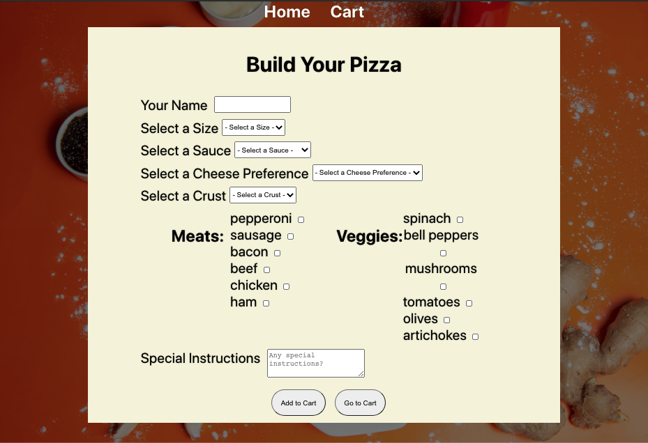
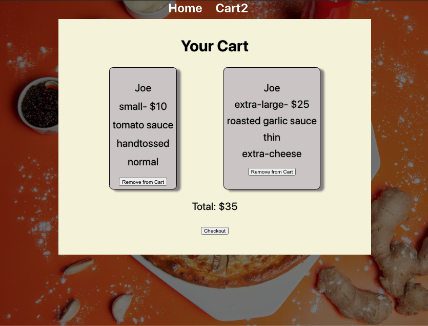

# Pizza Builder 🍕

This project was bootstrapped with [Create React App](https://github.com/facebook/create-react-app).

This is a simple application with a basic form for building a pizza. It allows a user to make several selections and add multiple pizzas to the cart. The user can remove items from the cart and see the total cost.

***

